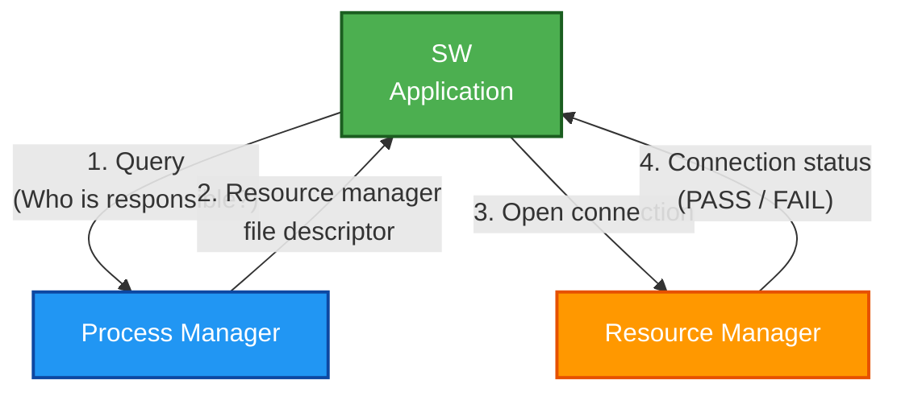

### How does resource manager work

```mermaid
flowchart TB
    Client["SW<br/>Application"]
    PM["Process Manager"]
    RM["Resource Manager"]

    Client -->|"1. Query<br/>(Who is responsible?)"| PM
    PM -->|"2. Resource manager<br/>file descriptor"| Client

    Client -->|"3. Open connection"| RM
    RM -->|"4. Connection status<br/>(PASS / FAIL)"| Client

    style Client fill:#4CAF50,stroke:#1B5E20,stroke-width:2px,color:#FFFFFF
    style PM fill:#2196F3,stroke:#0D47A1,stroke-width:2px,color:#FFFFFF
    style RM fill:#FF9800,stroke:#E65100,stroke-width:2px,color:#FFFFFF
```
