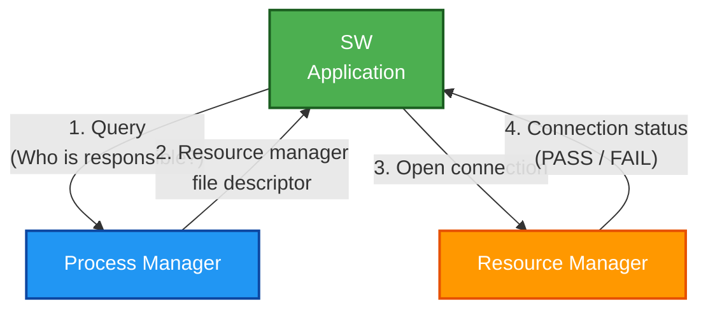
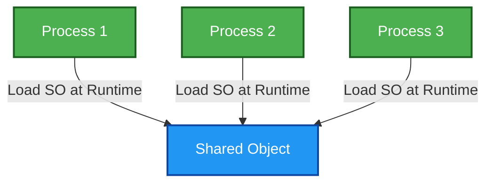
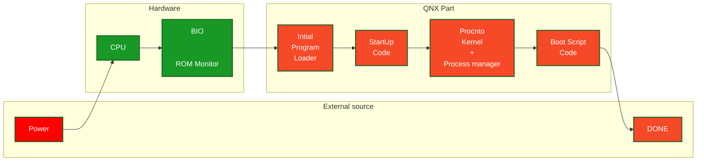

### How does resource manager work



----------------
### Shared library
- when multiple process wants to load some library at run time then those shared library are stored only once in the memory. 
- When a particular process calls it then the kernel loads it as <u>_**PROCESS PRIVATE**_ </u>Library in <u> _**read only**_</u> mode



-----------------------------------------------------------------
### OS Services

_**Services**_ can be _**dynamically created or removed**_.

Some example of Service/Process are 

```
1. random - Supply random numbers
2. mqueue - POSIX message queue IPC
3. dumper - Core dump creation
4. pipe   - Unix pipe
5. devb-* - Filesytem, usually rotating media e.g. SDCard
6. devf-* - Filesystem NOR flash
7. io-sock - TCP/IP stack
8. slogger2 - QNX System logger
9. pci-server - PCI bus access and configuration
```

Command used to <u>terminate a process</u> _**kill**_ 


----------------

### Boot Sequence 



The _**startup**_ code is :
- Board Soecific
- tells _**procnto**_ about core hardware
    - System RAM amount and layout
    - Interrupt Controllers and its address
    - _ClockCycles()_ per second i.e. it is reponsible for intialising clock
    - Special Memory reagin e.g. DMA address, Read Only, Write Only etc
    - **Cluster information**
- Communicate this data through system page (_**syspage**_)
    - **`syspage information is mapped to every PROCESS in read-only mode`**

 **`Drivers are intialised in BOOT SCRIPT section`**

-----------------------------------

### Security
- _**qconn**_ runs everything in root mode **this should never be shipped in production**
- _**setuid()**_ can be used to assign permission to the application like `root` or `qnxuser`
- **`secpolgenerate`** create security policy and stores the security policy **this is loaded on boot**
- QNX uses POSIX style attributes with user/group/other permissions

---------------------

**notes:**
```
- Process own resource and thread run code
- Drivers are processes in QNX
```

--------------
