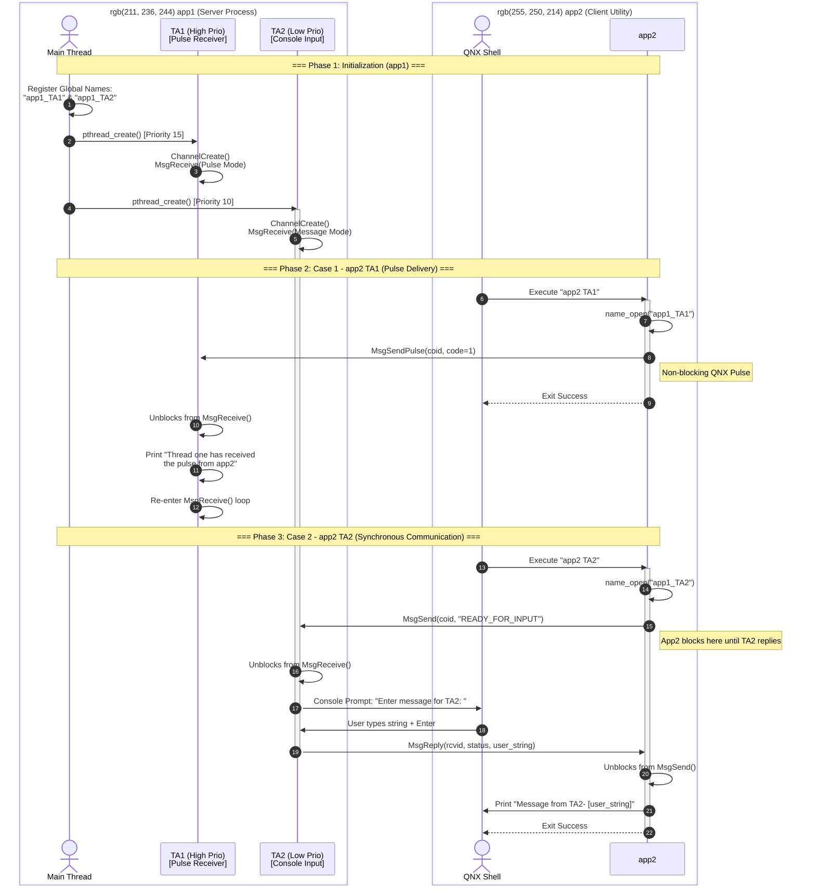

```mermaid
sequenceDiagram
    autonumber
    
    box rgb(211, 236, 244) app1 (Server Process)
        actor Main as Main Thread
        participant TA1 as TA1 (High Prio)<br/>[Pulse Receiver]
        participant TA2 as TA2 (Low Prio)<br/>[Console Input]
    end
    
    box rgb(255, 250, 214) app2 (Client Utility)
        actor Shell as QNX Shell
        participant App2 as app2
    end

    %% PHASE 1: INITIALIZATION
    note over Main, App2: === Phase 1: Initialization (app1) ===
    Main->>Main: Register Global Names:<br/>"app1_TA1" & "app1_TA2"
    Main->>TA1: pthread_create() [Priority 15]
    activate TA1
    TA1->>TA1: ChannelCreate()<br/>MsgReceive(Pulse Mode)
    Main->>TA2: pthread_create() [Priority 10]
    activate TA2
    TA2->>TA2: ChannelCreate()<br/>MsgReceive(Message Mode)

    %% PHASE 2: CASE 1
    note over Main, App2: === Phase 2: Case 1 - app2 TA1 (Pulse Delivery) ===
    Shell->>App2: Execute "app2 TA1"
    activate App2
    App2->>App2: name_open("app1_TA1")
    App2->>TA1: MsgSendPulse(coid, code=1)
    note right of App2: Non-blocking QNX Pulse
    App2-->>Shell: Exit Success
    deactivate App2

    TA1->>TA1: Unblocks from MsgReceive()
    TA1->>TA1: Print "Thread one has received<br/>the pulse from app2"
    TA1->>TA1: Re-enter MsgReceive() loop

    %% PHASE 3: CASE 2
    note over Main, App2: === Phase 3: Case 2 - app2 TA2 (Synchronous Communication) ===
    Shell->>App2: Execute "app2 TA2"
    activate App2
    App2->>App2: name_open("app1_TA2")
    App2->>TA2: MsgSend(coid, "READY_FOR_INPUT")
    note right of App2: App2 blocks here until TA2 replies

    TA2->>TA2: Unblocks from MsgReceive()
    TA2->>Shell: Console Prompt: "Enter message for TA2: "
    Shell->>TA2: User types string + Enter
    TA2->>App2: MsgReply(rcvid, status, user_string)
    deactivate TA2

    App2->>App2: Unblocks from MsgSend()
    App2->>Shell: Print "Message from TA2- [user_string]"
    App2-->>Shell: Exit Success
    deactivate App2
```
